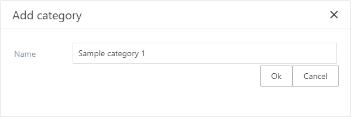
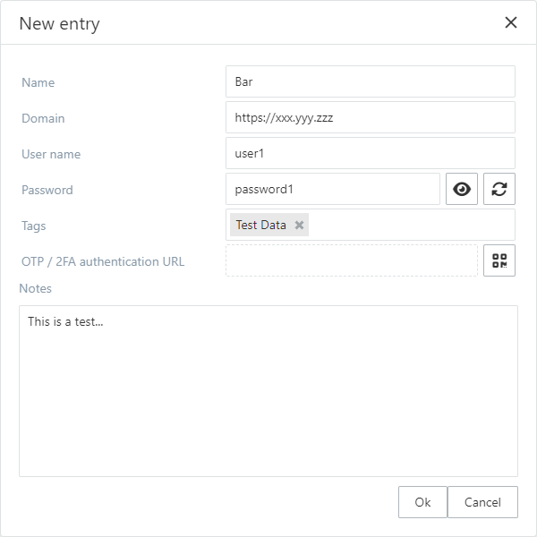
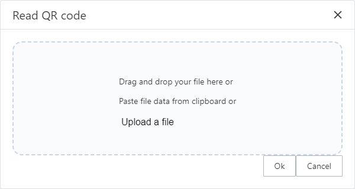
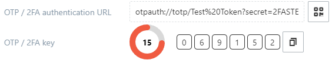
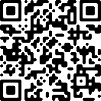

# Basic editing

This covers the basic editing such as adding categories and items.

## Adding categories

Categories can be added via the add category button or from the Items menu. There is no requirement of selection for the category adding to work as the categories can not have sub-categories.

The category needs to have a name not consisting only of white space. There are no other limits to a category name.

*The add category popup*

## Adding items

Items can be added via the add item button or from the [Items menu](the-main-window/#menu). Adding an item requires a [category](#adding-categories) or an item within a category to be selected.

There are no requirements or validation for the data input accepted as an item.

*The add item popup*

### Add OTP / 2FA authentication for an item

A [2FA](https://en.wikipedia.org/wiki/Multi-factor_authentication) or [TOTP (Time-based One-Time Password)](https://en.wikipedia.org/wiki/Time-based_one-time_password) can be added using a [QR code](https://en.wikipedia.org/wiki/QR_code).

The QR code can be given by
- Specifying a file (an image) to read the QR code from
- Dragging and dropping an image file into the *Read QR code* popup
- Pasting the QR code image data from the clipboard into the *Read QR code* popup

*The Read QR code popup*

After the QR code has been successfully given to the dialog the following message is displayed and the **OK** button can be clicked for storing the QR code data.

After the **OK** button click on success the code keeps generating. The actual [URL](https://en.wikipedia.org/wiki/URL) is not editable, it must be retrieved via the QR code.

*The code generating*

*The QR code used in the sample (see: [2FAS](https://2fas.com/check-token/))*

*In case of any failure the following message is displayed instead*

