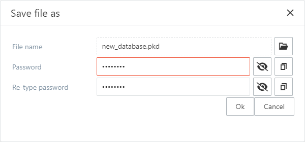
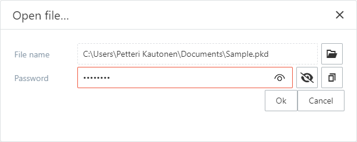

# Saving and opening files

## Save file as / Save a new file

Saving a new file and saving a file as are basically the same operations.
In both cases the password for the file needs to be specified and verified.

**NOTE: The password is not saved anywhere. You will have to remember the password in order to be able to open the file in the future.**

*The Save File As popup*

## Open file

A password is required for opening a file. The open file popup queries both the password and the file name and then the file is attempted to open.

*Open file popup*

If the file could not be opened with the specified password, a counter is increased causing the PasswordKeeper to close if the counter reaches the maximum value specified in the preferences. This is to prevent the PasswordKeeper itself to be used to try to open a file via brute force by some kind of automation process.

*The notification of a failed open file try*

## Saving existing file

The password specified when opening an existing file is preserved in the memory so the modifications made to an existing file can be just saved using the  save function.