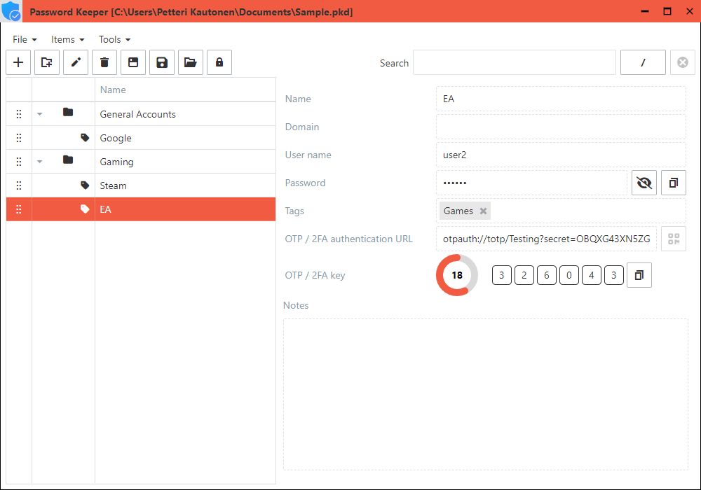
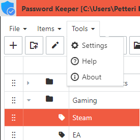
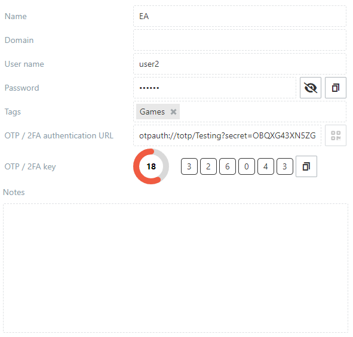

# The main window

An overview of the main window of the application.

The main window consists of 
- Title
- Menu
- Toolbar
- Search box
- Items view

## Title

The title displays the currently open file, e.g:

## Menu

The menu contains the items required for saving, opening and editing credential data among miscellaneous functions.

  

## Toolbar

The toolbar contains to most common used items also included in the main [Menu](#menu).

## Search box

The search box allows you to filter the items by searching the following fields:
- Name
- Domain
- User name
- Password
- Tags
- Notes

The search is <u>NOT</u> case-sensitive and the search terms can be separated by a space. The search strings don't need to be complete matches.

There are two modes of searching, the **OR** (`/`) and the **AND** (`&`) modes.

The **OR** mode is a match if one of the given search strings is a match.

The **AND** mode is a match if all of the given search strings match.

# Items view

The items view consists of tree list of items in their categories. On the left there is a detailed view of the selected item.

*The tree list*

*The item detailed view*

