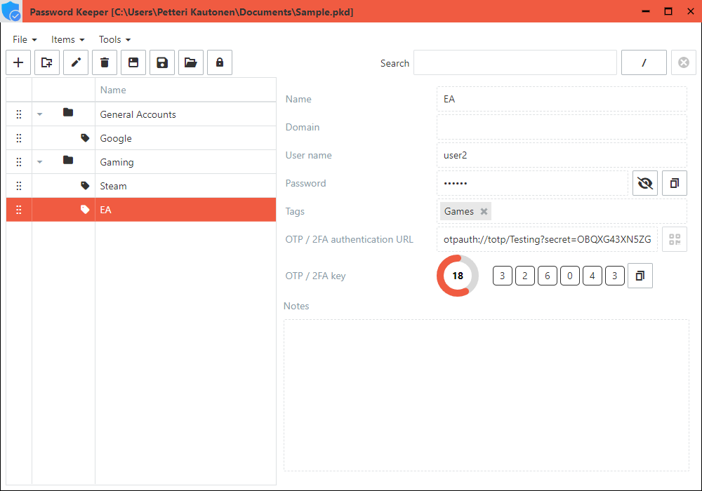

# About PasswordKeeper

PasswordKeeper is a file-based credential manager with [TOTP](https://en.wikipedia.org/wiki/Time-based_one-time_password) ([Time-based One-Time Password](https://en.wikipedia.org/wiki/Time-based_one-time_password)) support. The files are [AES](https://en.wikipedia.org/wiki/Advanced_Encryption_Standard) encrypted.

## The software
The UI is on [DevExtreme](https://js.devexpress.com) JavaScript components. The UI is quite simple; items divided into categories in a tree list with search, menu and toolbar.

## Installation

### Windows
Download the *PasswordKeeper_X.Y.Z_x64-setup.exe* from the latest [release](https://github.com/VPKSoft/PasswordKeeper/releases), ignore the warnings and install the software.
If the installation fails you may need to install [webview2](https://developer.microsoft.com/en-us/microsoft-edge/webview2/#download-section).

### Linux
1. Download the *password-keeper_X.Y.Z_amd64.AppImage* from the latest [release](https://github.com/VPKSoft/PasswordKeeper/releases).
2. Run `chmod +x password-keeper_X.Y.Z_amd64.AppImage` on the file.
3. Run the *password-keeper_X.Y.Z_amd64.AppImage* file.

### macOS
1. Download the *PasswordKeeper_x64.app.tar.gz* from the latest [release](https://github.com/VPKSoft/PasswordKeeper/releases).
2. Extract the `PasswordKeeper.app` from the file
3. Run `xattr -c PasswordKeeper.app` on the file.
4. Run the `PasswordKeeper.app`