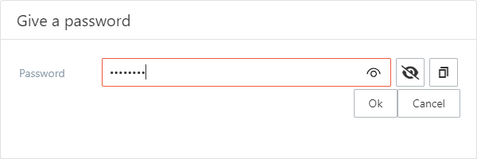

# View locking

## Main window locking

The main window locks automatically in a time period specified in the preferences. The main window can also be locked using the  lock view function.

When the view is locked all sensitive data is hidden. E.g. the item contents and search box is cleared and the category tree is collapsed.

The view can be unlocked by clicking the locked message. If an existing file is opened the password is required the view to unlock.

If the view could not be unlocked with the specified password, a counter is increased causing the PasswordKeeper to close if the counter reaches the maximum value specified in the preferences.

*The password query to unlock the view*

*The notification of a failed unlock attempt*

